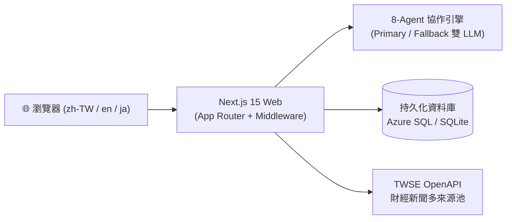

# Vestential 台灣股票 AI 分析與零股紀念品情報平台

> **名稱由來**：**Vestential = Vest + Essential**。Vest 代表「投資」、Essential 代表「不可或缺」——專為價值投資人打造的台股與美股研究平台。

Vestential 是基於 Next.js 15 與多代理人協作架構（Multi-Agent Architecture）開發的台股與美股投資輔助系統，提供 AI 深度個股分析、盤後零股行情、股東會紀念品整合情報、個人持股損益試算（含稅費淨損益、組合風險儀表板、交易日誌）、季線乖離與週期進場模型回測（含 AI 解讀）、交易策略閉環（點子→回測→計畫）。

* **線上體驗網站**：[https://vestential.com](https://vestential.com)
* **官方客服信箱**：`service@vestential.com`

---

## 🌟 核心功能一覽

| 功能模組 | 路由路徑 | 功能重點與特色 | 登入需求 |
| :--- | :--- | :--- | :---: |
| 🏠 **平台首頁** | `/` | 核心功能快速導覽、精選 6 則多來源 AI 市場焦點、大師投資心法收尾 | 免登入 |
| 📰 **AI 市場焦點** | `/market-focus` | 聚合鉅亨、經濟日報與 Yahoo 股市，產出 10 則平衡報導與「說人話」AI 重點摘要（含新聞影響結構化欄位） | 免登入 |
| 🤖 **AI 智能分析** | `/analyze` | 8-Agent 深度研判（技術、情緒、總經、基本面、多方辯論、經理人裁決），具備 0.3 秒無效標的熔斷門禁 | 需登入 |
| 🎁 **零股情報** | `/odd-lot` | 直連證交所 TWT53U 盤後零股數據、7 大主題分類、近 5 年紀念品歷程與官方日期交叉驗證 | 免登入 |
| 💰 **個人損益試算** | `/portfolio` | 台美股持倉、券商截圖 AI 批次辨識、5 大投資法則、含稅費淨損益並列、當年股息 YTD 估算（TWSE 除息真源，標「估」）＋四欄問號說明、組合風險儀表板＋壓力測試、卡片｜表格雙檢視、訪客模式與 120-bit 認領碼 | 部分功能需登入 |
| 📒 **交易日誌** | `/journal` | 交易紀錄 CRUD＋月統計＋AI 覆盤（紀律歸因，與 analyze 共用每日 3 次） | 需登入 |
| 🌕 **節慶橫幅** | 全站（Header 下方） | 節日當天自動顯示賀圖橫幅、隔日恢復；節慶社群賀文全自動發布 | 免登入 |
| 📉 **季線乖離回測** | `/backtest` | 60 日均線（季線）乖離率演算法、3 大波段風格卡片、代號與中文名即時雙向辨識、Top 20 成交量排行、點子一鍵回測、AI 解讀區（數字禁自創） | 免登入 |
| 🔄 **週期進場** | `/cycle-entry` | 掃描全市場找出「已現合適進場點」標的，提供週期進場時點與強度判斷，盤後自動更新 | 免登入 |
| ⚔️ **AI Agent 競技場** | `/agent-arena` | 4 隻固定角色 AI agent（起始資金 NT$500,000）依台灣時間五階段實戰決策，標的池為市值前 200＋ETF，交易競賽與每日排行榜 | 免登入 |
| 📈 **個股頁** | `/stock/[symbol]` | 單一標的的深度資料瀏覽與分析入口 | 免登入 |
| 🔐 **後台管理** | `/admin` | 管理員後台（社群小編乾跑、節慶發文、首回覆提問開關、競技場檢視、使用量、設定等） | 需管理員 |
| 🔐 **會員登入** | `/login` | Google 與 LINE 第三方快速登入，安全管理每日免費配額 | — |

👉 各項功能的深入演算法、公式與操作流程，請參閱 [核心功能與模組手冊](./docs/features-guide.md)。

---

## 🏗️ 系統架構簡介

平台採用現代化 Monorepo 架構與高可用性設計：



- **全端框架**：Next.js 15 (React 19, App Router) + Tailwind CSS。
- **AI 推理引擎**：多代理人協作機制，三層熱備援（主 Google Gemini → 備援一 Groq 新 key → 備援二 Groq 舊 key，不同池）＋錯峰／退避，保障服務不中斷（詳見技術手冊 §4）。
- **雙資料庫相容**：本地開發採用 SQLite，雲端生產環境支援 Azure SQL Server，配備資料增量遷移與防洗保護。
- **國際化語系**：內建中、英、日三語系路由與即時切換。

👉 深入了解多代理人協作架構與容錯機制，請參閱 [系統架構與技術手冊](./docs/architecture-and-tech.md)。

---

## 🚀 快速開始 (Quick Start)

三步驟即可在本機端啟動完整的開發環境：

### 1. 安裝套件與設定環境

```bash
# 安裝所有工作區相依套件
npm ci

# 建立本機環境變數檔案
cp .env.example .env.local
```

在 `.env.local` 填入您的 LLM API Key（支援 OpenAI 相容規格、Gemini 或 Groq）：

```env
LLM_PROVIDER=openai
OPENAI_API_KEY=your_api_key_here
LLM_BACKEND_URL=https://opencode.ai/zen/v1
DEEP_THINK_MODEL=big-pickle
QUICK_THINK_MODEL=big-pickle
```

### 2. 初始化資料庫與爬蟲種子

```bash
# 抓取台股零股與股東會紀念品初始數據
npm run seed --workspace=packages/database
```

### 3. 編譯與啟動服務

```bash
# 編譯所有內部套件
npm run local-build

# 啟動本機開發伺服器
npm run dev
```

開啟瀏覽器造訪 [http://localhost:3000](http://localhost:3000) 即可開始使用。

---

## 📚 專案文檔手冊索引

為了便於維護與深入查閱，詳細技術規格與操作指引已獨立整理於 `docs/` 目錄：

- 📖 **[核心功能與模組手冊](./docs/features-guide.md)**  
  收錄個人損益試算（含稅費淨損益、組合風險、交易日誌、表格檢視）、截圖 OCR、零股紀念品 7 大分類、季線乖離回測（含 AI 解讀與點子流）、週期進場、AI Agent 競技場（50 萬起始、前 200 池）、後台與社群小編（含節慶發文、首回覆提問）規範。
- ⚙️ **[系統架構與技術手冊](./docs/architecture-and-tech.md)**  
  Monorepo 結構、8-Agent 協作邏輯、0.3 秒熔斷門禁、Primary/Fallback 雙模型備援、持久化儲存機制與 2026-09 新增模組。
- ☁️ **[Azure 部署與維運手冊](./docs/deployment-and-ops.md)**  
  GitHub Actions 自動化 CI/CD、繞過 Oryx 記憶體不足的打包技巧、Secrets 清單、Issue 驅動開發鏈路（`/dev-loop`）、7 個定時排程＋自動部署、社群憑證維運與排錯步驟。
- 🔐 **[身分驗證與配額規範手冊](./docs/auth-and-quota.md)**  
  Google 與 LINE OAuth 申請流程、JWT Session 安全規範、每日 3 次 AI 分析與 10 次圖片辨識配額機制。
- ✉️ **[品牌專屬客服信箱建置手冊](./docs/custom-domain-email-setup.md)**  
  利用 Spaceship 免費轉寄 + Gmail SMTP 建立 `service@vestential.com` 的 100% 免費官方客服信箱教學。
- 🎨 **[品牌設計資產](./docs/design/)**  
  設計準則（`design-guideline.md`）與歷代 Logo 產出（`docs/design/icons/`）。

---

## 📄 授權條款 (License)

本專案採用 **Sustainable Use License 1.0 (SUL)**（fair-code / source-available 授權模式，同 n8n）：

- ✅ **個人學習、研究與非商業用途**：完全免費，原始碼公開於 GitHub 可自由研讀與個人使用。
- ❌ **商業營利限制**：嚴禁未經許可將本專案或其衍生版本部署為商用收費服務或轉售予第三方。
- 🔒 **商業授權合作**：若有商用需求，請透過 GitHub [Issues](https://github.com/YozoraRoy/vestential/issues) 提出，或寄信至官方信箱 `service@vestential.com`。

完整條款細節請參閱 [`LICENSE`](./LICENSE)。
