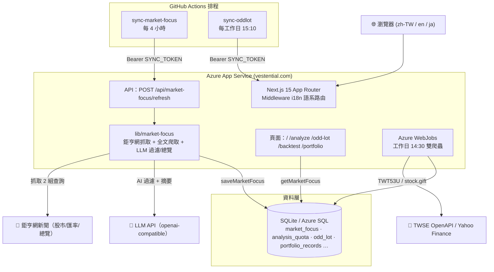

# Vestential 台灣股票 AI 分析與零股紀念品情報平台

> **名稱由來**:**Vestential = Vest + Essential**。Vest 代表「投資」、Essential 代表「不可或缺」——期許 Vestential 能成為你在[價值投資](https://vestential.com/about)路上的必備工具。

基於 Next.js 15 與多 AI 代理人 (Multi-Agent Architecture) 打造的台灣股票與美股 AI 深度分析、零股盤後行情、股東會紀念品情報與個人損益試算平台。

---

## 🌟 最新功能與核心特色 (2026 最新升級)

### 0. 🗺️ 功能與頁面一覽

| 頁面 | 路由 | 說明 | 需登入 |
|------|------|------|--------|
| 🏠 首頁 | `/` | 功能優先版面：核心功能 CTA 卡片 + AI 市場焦點新聞 + 投資名言收尾 | 否 |
| 📰 AI 市場焦點 | `/` (首頁區塊) + `/market-focus` (專屬頁) | 鉅亨網新聞 + AI 價值投資過濾，每 4 小時更新近 2 天新聞 6 則（含全文摘錄與當日總覽） | 否 |
| 🤖 AI 智能分析 | `/analyze` | 8-Agent 台股/美股深度分析（每日額度，未登入自動跳轉登入頁） | 是 |
| 🎁 零股情報 | `/odd-lot` | 零股行情與股東會紀念品情報 | 否 |
| 💰 個人損益試算 | `/portfolio` | 損益試算 + AI 圖片辨識批次上傳 + AI 投資建議 + 歷史紀錄 | 是 |
| 📉 週期進場模型回測 | `/backtest` | 台股季線乖離回測：自訂參數/風格卡片、代號與中文名即時雙向辨識、Top 20 成交量、季線乖離說明 | 否 |
| 🔐 登入 | `/login` | Google / LINE OAuth 登入 | 否 |
| 📄 隱私權政策 | `/privacy` | 隱私政策頁面 | 否 |
| 📄 服務條款 | `/terms` | 使用條款頁面 | 否 |

### 1. 💰 個人損益試算與 AI 投資建議 (`/portfolio`)
* **多市場持倉輸入**：支援台股（純數字代號自動帶入 `.TW`/`.TWO`）與美股，填寫持有股數、每股成本，系統自動抓取即時報價（可手動覆蓋現價）與股息，即時計算成本、市值、未實現損益與總報酬率（含 Yield on Cost）。
* **📷 AI 圖片辨識批次上傳持股**：直接上傳／拖曳券商 App 持股截圖或對帳單照片（PNG/JPG，≤10MB），AI 自動辨識出多檔股票的市場、代號、名稱、股數、成本、現價與股息，可逐檔修改／刪除後「全部建立損益紀錄」。Vision 依賴 LLM 的圖片輸入能力（Google `gemini` 或 OpenAI 相容 endpoint），失敗自動切換備援模型。
* **5 大投資法則 (Investment Frameworks)**：套用 **巴菲特價值投資**、成長股投資、股息投資、動能投資與均衡配置等框架，交由 AI 產出 `BUY / HOLD / SELL / AVOID` 建議與理由。
* **AI 分析 SSE 串流**：`POST /api/portfolio/analyze` 以 Server-Sent Events 回傳分析進度與結果；自動抓取公司簡介與即時報價作為市場上下文。
* **圖片辨識 API**：`GET /api/portfolio/recognize`（查剩餘額度）/ `POST /api/portfolio/recognize`（multipart file 或 JSON base64 上傳辨識）。
* **辨識缺漏即時同步**：若圖片辨識不出股票代號或股價，該列第一欄 `#` 會出現「同步」按鈕，點擊即開啟共用候選清單（與 `/backtest` 相同邏輯：台股 local DB 中文名＋fuzzy＋Yahoo fallback），選取後自動填入代號/名稱並抓取即時現價。
* **個人歷史紀錄**：每次分析自動存入 `portfolio_records` 資料表，可在頁面展開歷史明細（含當時價格與 AI 建議）。
* **共用每日額度**：AI 損益分析與 `/analyze` 共用每日 3 次額度（`consumeAnalysisQuota`）；圖片辨識另有獨立 **每日 10 次** 額度（`consumeRecognitionQuota`，存於 `recognition_usage` 資料表），避免資源被濫用。

### 2. 🎁 零股行情與股東會紀念品情報 (`/odd-lot`)
* **TWSE 盤後零股官方 OpenAPI 直連**：介接證交所官方 OpenAPI (`TWT53U`)，載入全台灣上千檔零股成交價格與成交股數。
* **正確標示「盤後零股」資料**：TWT53U 為證交所於收盤後（約 15:00）公布之**盤後零股**交易資料，頁面正確標示「盤後零股」而非「開盤」，並顯示**最新盤後交易日**與**最後更新時間**，讓使用者明確知道資料新鮮度。
* **1 股單價與成交總金額雙欄位**：精準拆分為 **`💵 1股成交價`**（顯示例如 `NT$ 25.60`）與 **`💰 成交總金額`**（顯示例如 `NT$ 66.4 萬`），修復數值排序與多重複算問題。
* **紀念品智慧自動分類與 7 大頁籤篩選 (Filter Pills)**：
  * ✨ **全部** (全市場標的)
  * 📱 **eGift 電子禮卡** *(全新新增！自動歸類全台超商電子商品卡、咖啡兌換券與簡訊禮券)*
  * 💳 **超商禮券卡**（如 7-11 / 全家實體商品卡）
  * 🥣 **居家餐廚**（如 多用途矽膠隔熱餐墊、保溫杯、保鮮盒套組、快煮鍋）
  * 🧴 **清洁護理**（如 植萃洗手乳、肥皂禮盒）
  * 🔌 **3C與生活配件**（如 折疊傘、隨身線材、生活用品）
  * ⏳ **待公告** / ➖ **無紀念品** / 🎁 **其他商品**
* **📜 近 5 年股東會紀念品發放歷程 (Modal 彈窗 & API 端點)**：
  * **API 路由**：新增 `GET /api/gifts/history?stock_id=2887` 高效 JSON 端點。
  * **互動彈窗**：在紀念品名稱旁提供 **`近5年 📜`** 按鈕，點擊開啟 Glassmorphism 極致 Modal 彈窗，展示該檔股票 2022 ~ 2026 年近 5 年發放紀念品紀錄！
* **📅 台股開盤日曆與最後買進日智慧標註**：
  * **開盤上班日推算**：自動避開國定假日與週末休市，標明「最新開盤上班日」資訊。
  * **帶年份與跨年標示**：最後買進日格式化為 **`YYYY/MM/DD (週X)`**（例 `2026/04/22 (週三)`），若跨年自動加上 **`跨年`** 專屬標籤。
* **🛡️ 官方日期交叉驗證與「最新日期優先」顯示**：
  * **TWSE 官方日期**：介接 TWSE OpenAPI `t187ap41_L`（上市公司股東會日期），與第三方 stock.gift 日期分欄存放 `twse_meeting_date`，用兩套獨立官方/第三方來源交叉驗證。
  * **驗證狀態徽章**：每列依「日期 + 內容」二維比對 MOPS / TWSE / stock.gift，顯示 ✅已驗證、⚠️日期不符、🚨贈品衝突、➖未發放、⏳未驗證 徽章（`validation_status` / `validation_reason` 欄位）。
  * **最新日期優先（顯示邏輯）**：當 TWSE 官方日期較新時，最後買進日改以 TWSE 官方股東會日期推斷年份，並標示 **`官方`** 標籤，確保呈現最正確的會期。
  * **驗證腳本**：`npm run sync:validate-gifts`（`packages/database`）批次為全體紀念品列寫入驗證狀態；新增 migration `005_gift_validation.sql`。

### 3. 📉 週期進場模型回測 (`/backtest`)
* **台股季線乖離回測**：以 **60 日均線（季線）乖離** 為進場訊號——當收盤價低於 MA60 的乖離率 ≤ 某閾值時觸發，於次一交易日進場。演算法掃描一組乖離閾值（如 -2%、-4%、-6%…），回測每個閾值的歷史勝率、觸發次數與平均達成天數，挑出「最佳進場乖離率」。
  * 公式：`乖離率 = (收盤價 − MA60) / MA60 × 100%`，負值越大代表跌幅越深才進場。
* **可調整參數與策略風格預設**：
  * **策略風格推薦（三欄等寬響應卡片）**：支援一鍵切換 **🚀短線波段**（40日 / +8% / -5% / 5年）、**📊中期波段**（120日 / +15% / -8% / 10年）、**🏛️長線週期**（預設：252日 / +25% / -12% / 15年）。介面採等寬響應網格卡片，附選中光暈與快速參數填入。
  * **自由參數設定**：進場後 **持有天數**（1–252 日）、**目標獲利 %**（1–100%、先到先勝）、**停損 %**（1–100%、先到先敗）、**近 X 年**（1–15 年）歷史資料，全部可在頁面即時調整後重新回測，輸入框皆附帶清楚之單位標籤（天/年/%）。
* **🔍 股票代號與中文名稱即時雙向辨識**：
  * 擴大搜尋輸入框（高度提升為 `h-11`，支援快速清除）。
  * 支援台股代號（如 `0050`、`00919`、`2330`）與中文名稱（如 `台積電`、`元大台灣50`）雙向檢索。輸入代號後，內部即時呈現辨識徽章，並於輸入框下方動態顯示「已辨識標的：代號 · 中文名稱 · 市場」，回測結果頂部同步顯示標的中文名稱摘要。
* **💡 季線乖離率知識卡片（可折疊）**：在回測輸入區下方提供專屬的可折疊知識卡，詳細說明季線乖離率意義、乖離計算公式、波段進場邏輯與實戰判讀注意事項。
* **各閾值表與 tooltip**：列出每個乖離閾值的交易次數、勝率、進場價區間，欄位皆有說明 tooltip（含公式）；點擊列可展開每筆交易的進場日期、進場價與結果（勝/敗/平）。
* **目前乖離率狀態 (Live Bias)**：顯示 **昨收 vs MA60** 的目前乖離率（另抓即時報價顯示現價乖離）、最佳進場閾值對應的觸發收盤價，並標記目前乖離是否已落在進場區間、還需再跌多少才達標。
* **圖表**：股價 vs 60 日均線折線圖，紅點標示歷史進場觸發點。
* **🏆 成交量 Top 20 快速啟動器**：開始回測按鈕旁提供「Top 20 成交量」按鈕，開啟寬版 Modal 彈窗（`max-w-3xl`，768px，具備清晰的排名/代號/名稱/成交量表頭），列出 **上市** 股票成交量排行，可切換 **當日 / 當週 / 當月 / 當季**；點任一列即自動填入代號並開始回測。
  * 當日：單一呼叫 TWSE `STOCK_DAY_ALL`；當週/當月/當季：逐日抓取 `MI_INDEX` 歷史全市場成交股數後累加排序（並發限 6＋TTL 快取）。
* **功能使用事件追蹤（自建，非 GA）**：造訪 `/backtest` 會記錄 `page_view`、點擊回測會記錄 `backtest_run`（含代號）；登入時自動歸屬帳號，匿名記為 `user_id = null`。DB 失敗靜默忽略、不影響功能。
* **API**：`GET /api/backtest`（主回測）、`GET /api/backtest/live-bias`（目前乖離）、`GET /api/backtest/top-volume?range=day|week|month|quarter`（成交量 Top 20）、`POST /api/backtest/track`（記錄 `page_view`/`backtest_run` 事件）、`GET /api/backtest/stats`（造訪與回測啟用統計）、`GET /api/stocks/search?q=&market=tw|us`（共用股票搜尋：回測／投資組合同步共用，台股 local DB＋fuzzy＋Yahoo fallback）。

### 4. 🤖 專屬 `verifier-agent` (檢查驗證 Agent)
* **自動進程管理**：每次修改後自動檢查 Port 3000，若有舊 dev 伺服器會強制關閉並重啟乾淨的 `localhost:3000`。
* **SQL 數據與 API HTTP 三層自動化測試**：自動連線 SQLite 資料庫 (`stock.db`) 核對關鍵欄位，並實測 `GET /api/odd-lot` 與 `GET /api/gifts/history` HTTP 回應。

### 5. ⚡ 股票代號智慧自動補全與 0.3 秒熔斷門禁 (Early-Exit Guard)
* **台股代號智慧補全**：輸入純數字台股代號（例如 `2330` 或 `0050`），系統自動辨識並補充 `.TW`（上市）或 `.TWO`（上櫃），無需使用者手動打副檔名。
* **無效代號 0.3 秒熔斷門禁**：在 8 個 AI 代理人啟動前進行實時數據驗證。若輸入無效代碼，系統在 **0.3 秒內立即中斷阻斷**並給予親切提示，**絕不白白浪費等待時間與 LLM API 額度**。

### 6. 🔐 Google / LINE 登入與每日額度 (OAuth)
* **Google / LINE OAuth 登入**：`/login` 頁面提供 Google 與 LINE 登入（LINE 採用 OpenID `openid profile` scope，email 為可選欄位）。
* **每日 3 次 AI 額度**：登入後每日可進行 3 次深度分析（`consumeAnalysisQuota`，以台灣時區為準），超過即回 `429 Too Many`，額度紀錄存於 `analysis_quota` 資料表。

### 7. ⏰ Azure 雙重定時自動排程機制 (WebJobs & Cron API)
* **Azure WebJobs 雲端內建排程**：台灣時間每個工作日下午 **14:30** 盤後自動啟動 TWSE 零股與 `stock.gift` 雙爬蟲與 eGift 智慧正規化，無縫更新資料庫。
* **Cron HTTP API 端點 (`/api/cron/seed`)**：提供 API 端點支援外部 Cron 服務（如 Azure Logic Apps, GitHub Actions）隨時觸發全台爬蟲！
* **GitHub Actions 每日盤後零股同步**（`.github/workflows/sync-oddlot.yml`）：每週一至五 **台灣時間 15:10**（TWSE 盤後零股約 15:00 公布後）自動觸發，以 Asia/Taipei 時區推算交易日期後呼叫 `POST /api/odd-lot/refresh?date=YYYYMMDD`，帶 `Authorization: Bearer SYNC_TOKEN` 更新當日盤後零股行情，確保 production 資料庫每日自動保持最新。

#### 🛡️ 行情 refresh 端點安全保護 (`POST /api/odd-lot/refresh`)
* **授權門檻**：端點要求 **Bearer `SYNC_TOKEN`**（或已登入使用者），未授權回傳 `401`，防止外部任意寫入。
* **頻率限制 (節流)**：針對同一交易日期，**10 分鐘**內重複觸發會回傳 `throttled` 且不重複抓取，避免排程與手動更新互相疊加重複開支。
* **日期參數**：支援 `?date=YYYYMMDD`（或 `YYYY-MM-DD` / `YYYY/MM/DD`），未指定則以 Asia/Taipei 推算最近交易日。

### 🛡️ 8. 數據持久化與防洗資料保護 (Data Loss Prevention)
* **資料庫路徑**：`DATABASE_PATH=/home/data/stock.db`（鎖定於 Azure NFS 持久化硬碟區）；若設定 `DATABASE_URL` 則使用 Azure SQL Server。
* **防洗資料保護**：系統會嚴格檢查持久化資料庫，**不會抹除整個 DB 檔／刪除歷史紀錄**——使用者的歷史 AI 分析紀錄與各交易日盤後資料**永久保留**。
* **盤後行情逐日更新**：零股盤後價量以 TWSE 官方 TWT53U 為唯一來源，每日 WebJob／GitHub Actions 排程（`sync-oddlot.yml`，台灣時間 15:10）／手動更新時**逐股以官方值覆寫當日資料列**（SQLite `INSERT OR REPLACE`、Azure `MERGE`），不採任何硬編碼參考價覆寫，確保與證交所一致。

### 🌐 9. 國際化多語系路由與 SEO 最佳化 (i18n & SEO)
* **多語系路由中介軟體 (Next.js 15 Middleware)**：支援 **繁體中文 (`zh-TW`)、英文 (`en`)、日文 (`ja`)** 三種語系，透過 `apps/web/src/middleware.ts` 動態處理語系重寫、Cookie 偏好與瀏覽器語言偵測。
* **全站用詞一致性**：各語系導覽列、首頁功能卡片全面對齊（如繁體中文統一使用「AI 智能分析」、英文「AI Smart Analysis」、日文「AI スマート分析」）。
* **動態 Sitemap 與 Robots.txt**：自動生成符合規格之 `sitemap.xml` (`apps/web/src/app/sitemap.ts`) 與 `robots.txt` (`apps/web/src/app/robots.ts`)，完整宣告多語系 alternate 網址與頻率，利於 Google 等搜尋引擎精準索引。
* **資訊架構與視覺層次優化 (Typography Hierarchy)**：精心調校 `/about` 關於我們、`/backtest` 回測與 `/analyze` 分析頁面的字體階層、間距與對比度，提供一致且現代的金融工具視覺體驗。

### 🔖 10. 首頁 AI 市場焦點 (`/` Market Focus)
* **鉅亨網即時新聞抓取**：以鉅亨網（`news.cnyes.com`）股市／匯率／總覽三類目 SSR 頁內嵌的 JSON-LD `CollectionPage` 資料（headline/url/datePublished）建出候選池並去重（`lib/market-focus.ts`），每則皆為可直連原文的網址。
* **近 2 天過濾 + 最新優先**：候選新聞僅保留 **發布 2 天內** 之作，並以 ISO 8601 正規化 `published_at` 後依時間 **新到舊** 排序；DB `getMarketFocus` 另以 `ORDER BY published_at DESC, id DESC` 雙保險，杜絕過期舊聞或亂序展示。
* **全文摘錄抓取**：針對入選新聞以伺服器端抓取原文（先檢查 `robots.txt`，再以 cheerio 抽正文、截取前 4000 字），儲存 `content`；同時記錄解析後原始網址 `source_url`，頁面「前往原文」一律由原站優先。
* **AI 價值投資過濾與總覽**：排程呼叫 LLM，依「價值投資」精神篩選新聞並產出一句摘要（`filterNewsByAI`），再對入選清單生成「當日 AI 市場總覽」（`market_focus_meta.summary`）；LLM 失敗時自動 fallback 原樣前 6 則，首頁渲染永遠不會因 AI 或來源異常而變慢或報錯。
* **日夜自動更新**：`.github/workflows/sync-market-focus.yml` 每 **4 小時**以 `Authorization: Bearer SYNC_TOKEN` 呼叫 `POST /api/market-focus/refresh`（亦支援手動 `workflow_dispatch`），每次 refresh 以 DELETE＋重插覆寫最新一輪，符合「內容短存」隱私原則。
* **首頁與專屬頁呈現**：首頁每則顯示標題 / 來源 / 時間 / AI 摘要（三語 chrome），並有「查看完整頁面 →」連結；`/market-focus`（繁體中文內容）加入當日總覽、全文摘錄 `<details>` 展開、「前往原文」直連原站，並附方法說明與免責。

### 💻 11. 首頁版面與 SEO (`/`)
* **功能優先版面**：由上而下為 **① 精簡 Hero**（H1＋副標＋2 顆主 CTA：開始 AI 分析 / 看零股情報）→ **② 核心功能 6 卡**（依 `/about`「如何開始」STEP 1→2→3 順序：零股情報→週期進場→損益試算→AI 分析，再墊開發中卡）→ **③ 市場焦點** → **④ 投資名言收尾帶**（附投資風險免責一行）。
* **轉換元素**：每張功能卡具「立即使用 →」CTA，附 hover 上移與 accent 光暈回饋；開發中卡以「開發中」徽章標記、不提供死連結。
* **結構化資料**：首頁 JSON-LD `@graph` 含 `WebSite`＋`Organization`＋`WebPage`（inLanguage/dateModified），新聞存在時附 `ItemList`（title/url/datePublished），強化「新鮮內容」訊號。
* **社群分享圖 (OG)**：`apps/web/src/app/opengraph-image.tsx` 以 `next/og` 動態產生 1200×630 品牌漸層分享圖（零靜態素材）；metadata 帶 `openGraph`＋`twitter:card=summary_large_image`；`layout.tsx` 輸出 `theme-color=#0f1118`。

---

## 🏗️ 專案架構 (Architecture)

### 系統架構圖 (Mermaid)



### 專案目錄結構

```
stock-platform/
├── apps/
│   └── web/                 # Next.js 15 Web 應用程式 (App Router)
│       ├── src/app/         # 頁面與 API 路由 (/analyze /odd-lot /portfolio /backtest …)
│       │   └── src/app/api/market-focus/refresh/  # 市場焦點排程 refresh API
│       └── src/lib/         # 共享邏輯 (auth、oauth、portfolio、market-focus …)
├── packages/
│   ├── ai-engine/           # AI 8-Agent 分析引擎、Symbol Guard 門禁與投資法則分析
│   ├── backtest/            # 回測引擎
│   ├── core/                # 共享型別、設定與錯誤定義
│   ├── database/            # SQLite/SQL Server 資料庫 (雙爬蟲、analysis_quota、portfolio_records、market_focus)
│   └── market-data/         # Yahoo Finance 市場數據 Provider
├── App_Data/
│   └── jobs/triggered/      # Azure WebJobs 自動排程配置 (14:30 每日爬蟲)
├── .github/workflows/       # GitHub Actions 排程 (sync-oddlot 零股、sync-market-focus 新聞)
├── .agents/skills/
│   └── azure-deploy/        # 專屬 Azure 部署與診斷技能 (SKILL.md)
└── package.json             # npm workspaces 根目錄
```

---

## 🚀 快速開始 (Quick Start)

### 1. 安裝與環境設定

```bash
# 安裝依賴套件
npm ci

# 建立本地環境變數檔案
cp .env.example .env.local
```

編輯 `.env.local`：

```env
LLM_PROVIDER=openai
OPENAI_API_KEY=your_api_key_here
LLM_BACKEND_URL=https://opencode.ai/zen/v1
DEEP_THINK_MODEL=big-pickle
QUICK_THINK_MODEL=big-pickle
```

### 2. 爬蟲種子與資料庫初始化

```bash
# 執行全台零股與股東會紀念品雙爬蟲 (抓取 1,200+ 零股與 600+ 紀念品)
npm run seed --workspace=packages/database
```

### 3. 編譯與啟動

```bash
# 編譯所有工作區
npm run local-build

# 啟動開發伺服器
npm run dev
# → http://localhost:3000
```

---

## 🤖 8-Agent AI 分析流程

對股票進行分析時，系統會循序執行 8 個 AI 代理人（`/analyze`，需登入）：

1. **Market Technical Analyst** — K 線圖、均線、技術指標分析
2. **Sentiment Analyst** — 市場情緒與社群討論風向
3. **News & Macro Analyst** — 公司新聞與總體經濟分析
4. **Fundamentals Analyst** — 財務報表、營收與估值指標
5. **Bull Researcher** — 看多觀點辯論
6. **Research Manager** — 綜合評估 → 產出 Buy/Hold/Sell 評級
7. **Trader** — 具體交易計畫與進出場策略
8. **Portfolio Manager** — 最終投資決策與風險控制

> 每個 Agent 可獨立啟用/停用（`/api/analyze` 接受 `enabledAgents` 參數），並支援語言選擇（英文/繁體中文）與貨幣（USD / NTD）。輸入支援台股代號自動補全，無效代號在 0.3 秒內被熔斷阻擋，不浪費額度與等待時間。

---

## 🔁 LLM 備援機制 (API Token 備援)

系統支援 **Primary / Fallback 兩層模型備援**：Primary 模型失敗（rate limit、逾時、帳戶配額封鎖）時，自動切換至備援模型，並在該 Agent 的分析回報末尾附加一行備援 model + token 紀錄，同時保留 per-agent token 明細存入資料庫。

### 分組

模型分成 **deep** 與 **quick** 兩組，各自可獨立設定 primary / fallback：

| 組別 | 使用 Agent |
|------|-----------|
| **deep** | Research Manager、Portfolio Manager |
| **quick** | Market、Sentiment、News、Fundamentals、Bull Researcher、Trader |

### 環境變數

以「切到 Groq 免費 API」為例（OpenAI-compatible 端點）：

```env
FALLBACK_LLM_PROVIDER=openai

FALLBACK_DEEP_THINK_MODEL=qwen/qwen3.8-27b
FALLBACK_DEEP_LLM_BACKEND_URL=https://api.groq.com/openai/v1
FALLBACK_DEEP_LLM_API_KEY=gsk_...

FALLBACK_QUICK_THINK_MODEL=qwen/qwen3.8-27b
FALLBACK_QUICK_LLM_BACKEND_URL=https://api.groq.com/openai/v1
FALLBACK_QUICK_LLM_API_KEY=gsk_...
```

**優先序**：群組專屬 `FALLBACK_DEEP_*` / `FALLBACK_QUICK_*` > 通用 `FALLBACK_LLM_*` > 沿用 Primary（`LLM_BACKEND_URL` / `OPENAI_API_KEY`）。

### 切換紀錄

切換到備援模型時，會在該 Agent 回報末尾附加：
> ⚠️ 本回覆已自動切換至備援模型：**{model}** (Token: prompt X / completion Y / 合計 Z)

並在 `tokenUsage.agents` 中記錄每個 Agent 實際使用的 model、`usedFallback`、`fallbackCalls` 與 token 用量（存至 DB `model_usage` 欄位）。

---

## 🌐 部署與 Skill (Azure Deployment)

> **部署策略：一律透過 GitHub Actions (git runner) 自動部署。**

### 🚀 GitHub Actions 自動部署

每次推送 `main` 分支即自動觸發部署 Workflow (`.github/workflows/deploy.yml`)：

```bash
git add .
git commit -m "your change"
git push origin main   # ← 自動觸發部署
```

**流程**：GitHub Runner 上執行 `npm ci` → `npm run local-build` → 打包含 `node_modules` 的 `deploy.zip`（禁雲端 Oryx 建置，解決 B1 記憶體不足）→ 設定環境變數 → 透過 Kudu `zipdeploy?clean=true` 部署至 Azure。

**需要的 GitHub Secrets**（需在 `https://github.com/YozoraRoy/vestential/settings/secrets/actions` 設定）：

| Secret | 內容 | 對應 Azure App Setting |
|--------|------|--------------------------|
| `AZURE_CREDENTIALS` | Azure Service Principal JSON（`az ad sp create-for-rbac` 產生） | — |
| `OPENAI_API_KEY` | OpenCode AI API Key | `OPENAI_API_KEY` |
| `FALLBACK_DEEP_LLM_BACKEND_URL` | 備援（deep 組）免費 API 的 baseUrl，例 `https://api.groq.com/openai/v1`（可留空沿用 primary） | `FALLBACK_DEEP_LLM_BACKEND_URL` |
| `FALLBACK_DEEP_LLM_API_KEY` | 備援（deep 組）免費 API 的 apiKey | `FALLBACK_DEEP_LLM_API_KEY` |
| `FALLBACK_QUICK_LLM_BACKEND_URL` | 備援（quick 組）免費 API 的 baseUrl（可留空沿用 primary） | `FALLBACK_QUICK_LLM_BACKEND_URL` |
| `FALLBACK_QUICK_LLM_API_KEY` | 備援（quick 組）免費 API 的 apiKey | `FALLBACK_QUICK_LLM_API_KEY` |
| `DATABASE_URL` | SQL Server 連線字串 | `DATABASE_URL` |
| `SYNC_TOKEN` | 行情 refresh 端點 (`/api/odd-lot/refresh`) 授權用的 Bearer Token（`openssl rand -hex 32` 產生，需 ≥16 字元） | `SYNC_TOKEN` |
| `AUTH_SECRET` | 登入 JWT 簽章密鑰（`openssl rand -base64 32` 產生，禁止進 repo） | `AUTH_SECRET` |
| `GOOGLE_CLIENT_ID` | Google OAuth 用戶端 ID | `GOOGLE_CLIENT_ID` |
| `GOOGLE_CLIENT_SECRET` | Google OAuth 用戶端密鑰 | `GOOGLE_CLIENT_SECRET` |
| `LINE_CLIENT_ID` | LINE Channel ID | `LINE_CLIENT_ID` |
| `LINE_CLIENT_SECRET` | LINE Channel Secret | `LINE_CLIENT_SECRET` |

> `AUTH_BASE_URL` 為固定值 `https://vestential.com`，直接寫死在 `deploy.yml`，不需設為 Secret。部署時 `deploy.yml` 會把上表各 Secret 寫入 Azure App Settings。

**線上監看**：`gh run watch` 或 GitHub → Actions 頁面。

專案已內建專屬的 **Azure 部署 Skill**（含常見錯誤診斷手冊）：[SKILL.md](file:///d:/PG/stock-platform/.agents/skills/azure-deploy/SKILL.md)

### 🔐 Google / LINE 登入申請設定（OAuth）

> 目的：讓「Google 登入」與「LINE 登入」可以運作。需要到兩官方平台各建立一個 OAuth 應用程式，取得 **Client ID + Client Secret**，再加上自行產生的 **AUTH_SECRET**（JWT session 簽章密鑰）。
>
> 對應程式碼讀取的環境變數：`apps/web/src/lib/oauth.ts`、`apps/web/src/lib/auth.ts`

#### 需要的密鑰一覽

| 環境變數 | 來源 | 用途 |
|----------|------|------|
| `GOOGLE_CLIENT_ID` | Google Cloud Console | Google 登入的 client id |
| `GOOGLE_CLIENT_SECRET` | Google Cloud Console | Google 登入的 client secret |
| `LINE_CLIENT_ID` | LINE Developers | LINE 登入的 Channel ID（當 client id） |
| `LINE_CLIENT_SECRET` | LINE Developers | LINE 登入的 Channel Secret（當 client secret） |
| `AUTH_SECRET` | 自己產生 | 簽署登入 session JWT，**禁止進 repo** |
| `AUTH_BASE_URL` | 固定值（`https://vestential.com`） | callback 網址用的 base（部署時寫死，不需設 secret） |

> **安全性**：`CLIENT_SECRET` 與 `AUTH_SECRET` 只放本機 `.env.local`、GitHub Secret、Azure App Settings。**絕不可 commit 進 repo。**

#### 1. Google 登入（Google Cloud Console）

1. 進 [Google Cloud Console](https://console.cloud.google.com) → 選（或建立）你的專案。
2. 選單 **APIs & Services → Credentials** → **Create Credentials → OAuth client ID**。
3. Application type 選 **Web application**。
4. 在 **Authorized redirect URIs** 加入 callback 網址（`/api/auth/callback/google` 結尾）：
   - 本機：`http://localhost:3000/api/auth/callback/google`
   - 線上：`https://vestential.com/api/auth/callback/google`
5. 建立後記下 **Client ID** 與 **Client Secret**。

> 若 OK 畫面蘭第三方帳號，需把 OAuth consent screen 的測試狀態設為 published。

#### 2. LINE 登入（LINE Developers）

> ⚠️ **LINE 禁止 localhost / 私有 IP 作為 redirect URI**，只能填 https，因此 Line 無法在本機直接測。本機測額度流程請改用 `/api/auth/dev-login`（僅非 production 提供）。

1. 到 [LINE Developers](https://developers.line.biz)：
   - 使用 LINE 帳號登入 → 建立一個 **Provider** → **Create a LINE Login channel**。
2. 填基本資訊後，進入 channel 的 **LINE Login → Settings**。
3. 在 **Redirect URI** 加入線上 callback：
   - 線上 callbacks：`https://vestential.com/api/auth/callback/line`（與 `https://stock-platform-roy.azurewebsites.net/api/auth/callback/line` 需與 `AUTH_BASE_URL` 一致）
4. 記下 **Channel ID**（當 client id）與 **Channel Secret**（當 client secret）。
5. （選擇性）若要取得 user email：在 channel 開 **email permission** 並送審；MVP 未開也能登入（email 為 NULL）。

> 相關 code：Scope 用 `openid profile`，profile 抓 `https://api.line.me/v2/profile`（無 email）。

#### 3. AUTH_SECRET（共用，自行產生）

不來自任何平台，純粹是簽章密鑰，用以下指令產生：

```bash
openssl rand -base64 32
# 例如：gQ7Y... 一串隨機 base64
```

只填入 `.env.local`／GitHub Secret／Azure App Settings。

#### 依執行階段需要申請的項目

| 來源 | 本機開發 | 上線 |
|------|----------|------|
| Google Client ID / Secret | ✅（callback 加 localhost） | ✅ |
| LINE Client ID / Secret | ❌（LINE 禁 localhost，用 dev-login 測） | ✅ |
| AUTH_SECRET | ✅ | ✅ |
| AUTH_BASE_URL | 可略或填 `http://localhost:3000` | ✅ 固定寫死 `https://vestential.com` |

#### 設定位置

- 本機開發：`apps/web/.env.local`（參考根目錄 `.env.example`）
- 上線 CI：`.github/workflows/deploy.yml` 會把 GitHub Secrets 寫入 Azure App Settings

#### 常見問題

**provider not configured（登入 503）**
代表該 provider 的 `CLIENT_ID`／`CLIENT_SECRET` 沒有都設定，`oauth.ts` 的 `isProviderConfigured()` 不會通過。檢查對應環境變數是否齊全。

**LINE 無法本機測**
LINE 不允許 localhost callback，請用 `/api/auth/dev-login` 或先在線上驗證 LINE。

* **線上體驗網站**：[https://vestential.com](https://vestential.com)
* **GitHub 倉庫**：[https://github.com/YozoraRoy/vestential](https://github.com/YozoraRoy/vestential)

---

## 📄 License

本專案採用 **MIT License**（詳見 [`LICENSE`](./LICENSE)）。

```text
MIT License

Copyright (c) 2026 Yozora Roy

Permission is hereby granted, free of charge, to any person obtaining a copy
of this software and associated documentation files (the "Software"), to deal
in the Software without restriction, including without limitation the rights
to use, copy, modify, merge, publish, distribute, sublicense, and/or sell
copies of the Software, and to permit persons to whom the Software is
furnished to do so, subject to the following conditions:

The above copyright notice and this permission notice shall be included in all
copies or substantial portions of the Software.

THE SOFTWARE IS PROVIDED "AS IS", WITHOUT WARRANTY OF ANY KIND, EXPRESS OR
IMPLIED, INCLUDING BUT NOT LIMITED TO THE WARRANTIES OF MERCHANTABILITY,
FITNESS FOR A PARTICULAR PURPOSE AND NONINFRINGEMENT. IN NO EVENT SHALL THE
AUTHORS OR COPYRIGHT HOLDERS BE LIABLE FOR ANY CLAIM, DAMAGES OR OTHER
LIABILITY, WHETHER IN AN ACTION OF CONTRACT, TORT OR OTHERWISE, ARISING FROM,
OUT OF OR IN CONNECTION WITH THE SOFTWARE OR THE USE OR OTHER DEALINGS IN THE
SOFTWARE.
```
