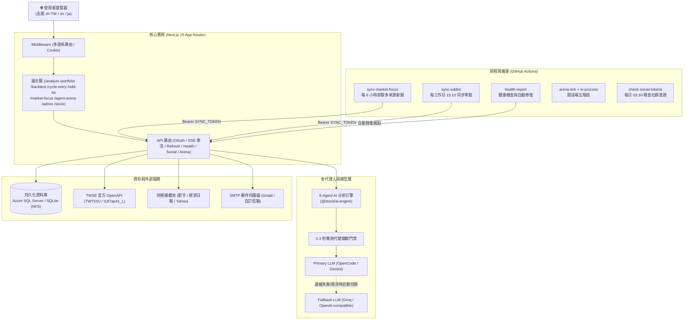

# 系統架構與技術手冊

本文件說明 Vestential 的 Monorepo 結構、8-Agent AI 協作引擎、雙層 LLM 備援與雙資料庫持久化機制。

---

## 1. 系統架構總覽

---

## 2. Monorepo 工作區分工

專案採用 npm workspaces 架構管理：

| 套件 / 目錄 | 職責說明 |
| :--- | :--- |
| **`apps/web`** | Next.js 15 現代化 Web 前端，採用 App Router、Tailwind CSS 與 Server Actions。 |
| **`packages/ai-engine`** | 8 個專業分析代理人、Prompt 模板、0.3 秒無效標的門禁機制與投資法則引擎。 |
| **`packages/backtest`** | 60 日均線乖離率回測演算法、勝率計算與歷史回測資料快取。 |
| **`packages/cycle-entry`** | 週期進場回測引擎（`rules.ts`／`runSignalBacktest`），供 `/cycle-entry` 與後台使用。 |
| **`packages/database`** | 雙資料庫抽象層（SQLite / Azure SQL）、遷移指令碼與批次同步排程。 |
| **`packages/market-data`** | Yahoo Finance 報表擷取、TWSE 盤後數據清洗與歷史價量快取。 |
| **`packages/core`** | 全域型別定義、設定常數與自訂例外錯誤類別。 |

---

## 3. 8-Agent AI 協作引擎

進入 `/analyze` 進行深度分析時，系統循序啟動 8 個分工代理人，各司其職：

1. **Market Technical Analyst（技術面分析師）**：計算均線多空排列、KD/RSI 動能與關鍵支撐壓力。
2. **Sentiment Analyst（市場情緒分析師）**：分析社群討論熱度與散戶恐慌/貪婪指標。
3. **News & Macro Analyst（總經與新聞分析師）**：爬梳重大新聞要聞與央行貨幣政策影響。
4. **Fundamentals Analyst（基本面分析師）**：檢視三大財務報表、毛利率、自由現金流與估值位階。
5. **Bull Researcher（多方觀點辯論員）**：挖掘潛在利多題材與獲利爆發點。
6. **Research Manager（研究主管）**：整合多空觀點，裁定最終評級（買進 / 續抱 / 賣出）。
7. **Trader（交易員）**：制定具體的進場買點、分批加碼點與停損停利價格。
8. **Portfolio Manager（投資組合經理）**：從整體資產配置與風險分散角度給予最終配置比例。

> **0.3 秒無效代號熔斷門禁 (Early-Exit Guard)**：
> 在耗費 LLM 額度之前，系統先於記憶體高速驗證股票代號真實性。若輸入不存在代碼，立即在 0.3 秒內回傳錯誤並提示修正，避免浪費使用者的等待時間與每日配額。

---

## 4. 雙層 LLM 備援機制 (Primary / Fallback)

為避免單一模型供應商發生 Rate Limit（429）、逾時或額度耗盡，系統內建完整的**雙模型熱備援**。

### 模型分組
- **Deep 組（重推理深度決策）**：負責 Research Manager 與 Portfolio Manager。
- **Quick 組（快速數據與情緒摘要）**：負責 Technical、Sentiment、News、Fundamentals、Bull Researcher 與 Trader。

### 容錯切換邏輯
1. 預設先連線 Primary 模型。
2. 連線失敗、回應超時或回傳 429 時，系統自動重試並平順切換至 Fallback 端點（如 Groq 或次要模型）。
3. 切換後自動於分析報告末端標記 `⚠️ 本回覆已自動切換至備援模型：{model}`，並將各 Agent 實際使用的模型名稱與 Token 數精準記錄於資料庫。

---

## 5. 雙資料庫相容與數據持久化 (Data Persistence)

本平台同時支援輕量級本機開發與高可用雲端環境：

- **本機開發與輕量佈署**：使用 SQLite（資料庫檔案預設位於 `stock.db` 或 Azure 永久儲存區 `/home/data/stock.db`）。
- **正式雲端生產環境**：設定 `DATABASE_URL` 後自動啟用 Azure SQL Server 連線池。生產庫為 `stockdb`（Server `sql-stock-platform`，**Basic / 5 DTU / 2 GB**）；用量監控與容量排錯見 `docs/deployment-and-ops.md` §4 Q3。
- **防抹除保護 (Data Loss Prevention)**：所有資料表均透過 SQL 遷移檔案管理（`packages/database/migrations`），啟動時採 `IF NOT EXISTS` 或 `ALTER` 增量升級，絕不重置或清空已存在的用戶持股紀錄與分析歷史。

---

## 6. 國際化多語系與 SEO

- **Next.js 15 Middleware 路由**：全面支援 **繁體中文 (`zh-TW`)**、**英文 (`en`)** 與 **日文 (`ja`)**。透過 Cookie 與 Accept-Language 自動判定偏好，並保持無跳轉切換。
- **動態 Sitemap 與中繼資料**：動態產生 `sitemap.xml` 與 `robots.txt`，對外宣示所有語系的 canonical 與 alternate 連結，符合現代搜尋引擎最佳化標準。

---

## 7. 2026-09 新增模組（概要）

以下模組於 2026-09 陸續上線，細節與操作規範見 `docs/features-guide.md` §6~§8：

### 7.1 AI 競技場 (`/agent-arena`)
- 4 隻固定角色 agent 每日依台灣時間五階段角逐票選：premarket 09:00（briefing）→ slot 0~3（09:35/10:35/11:35/13:05 決策）→ 15:30（discussion + 裁決 + 排行榜）。
- 主要時鐘為 **in-process** 的 `apps/web/src/lib/arena-scheduler.ts`（`ARENA_CRON_ENABLED=true`），GH Actions `arena-tick.yml` 為備援。
- 股票池：內建預設 24 檔（`DEFAULT_ARENA_UNIVERSE`）＋動態前高市值股池＋ETF；後台可覆寫滑價等參數（預設 `0.003`）。
- 資料表：`arena_agents`、`arena_rounds`、`arena_agent_actions`、`arena_round_summaries`、`arena_intraday_prices`、`arena_decision_logs`、`arena_market_briefings`、`arena_discussions`。

### 7.2 社群小編（IG / Threads / FB）
- 每日盤後自動生成三平台文案＋圖卡，經去重與 `hasNewEdition` 門檻後自動發文。
- 圖卡三種風格（`ai` / `classic` / `meme`），**預設 `ai`（AI 吉祥物全圖卡）**；後台可乾跑預覽。
- 發布邏輯在 `apps/web/src/lib/social-trigger.ts`＋`social-publish.ts`；憑證與換發維運見 `docs/deployment-and-ops.md` §5。

### 7.3 週期進場 (`/cycle-entry`)
- 以季線乖離演算法為基礎的週期進場模型掃描，`sync-cycle-entry.yml` 每個交易日 16:00 更新；計算引擎在 `packages/cycle-entry`。

### 7.4 後台管理 (`/admin`)
- 獨立管理後台（`admin/layout.tsx` 守衛＋側欄），8 個子頁：總覽、市場焦點、週期進場、社群小編、競技場、使用量、設定、訂閱者。
- 守衛邏輯為 `lib/auth.ts` 的 `isAdminUser`（`ADMIN_LINE_USER_IDS` / `ADMIN_EMAILS` 判定）。
